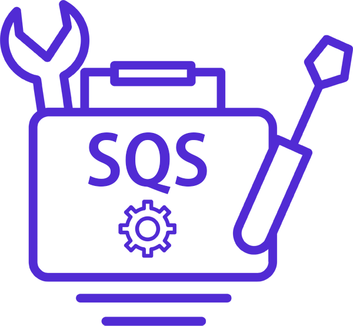

# SQS Toolbox

This is a work-in-progress repository for a set of libraries, extensions and helpers to support working with AWS Simple Queue Service from .NET applications.

<p align="center">
  
</p>

## Base Package

| Package | NuGet Stable | NuGet Pre-release | Downloads | 
| ------- | ------------ | ----------------- | --------- | 
| [DotNetCloud.SqsToolbox](https://www.nuget.org/packages/DotNetCloud.SqsToolbox) | [](https://www.nuget.org/packages/DotNetCloud.SqsToolbox) | [](https://www.nuget.org/packages/DotNetCloud.SqsToolbox) | [](https://www.nuget.org/packages/DotNetCloud.SqsToolbox) | 

## Extensions

| Package | NuGet Stable | NuGet Pre-release | Downloads | 
| ------- | ------------ | ----------------- | --------- | 
| [DotNetCloud.SqsToolbox.Extensions](https://www.nuget.org/packages/DotNetCloud.SqsToolbox.Extensions) | [](https://www.nuget.org/packages/DotNetCloud.SqsToolbox.Extensions) | [](https://www.nuget.org/packages/DotNetCloud.SqsToolbox.Extensions) | [](https://www.nuget.org/packages/DotNetCloud.SqsToolbox.Extensions) | 

# Features

## SQS Polling Queue Reader

**Status**: Work in progress, released in alpha.

Supporting types for polling an SQS queue repeatedly for messages in a background `Task`.

### Design Goals

Support minimal boilerplate code required for the common scenario in a queue processing worker service. Most of the code is provided by the library, with extension points for customisation of the default behaviours. When used in a `Host` based worker service or ASP.NET Core app, service registrations support registration of readers for multiple, logically named queues.

### Quick Start

**WARNING**
These packages are considered alpha quality. They are not fully tested and the public API is likely to change during development and based on feedback. I encourage you to try the packages to provide your thoughts and requirements, but perhaps be wary of using this in production!

The most convenient consumption pattern is to utilise the DotNetCloud.SqsToolbox.Extensions package which provides extensions to integration with the Microsoft dependency injection and configuration libraries.

Add the latest alpha NuGet package from [nuget.org](https://www.nuget.org/packages/DotNetCloud.SqsToolbox.Extensions).

Inside an ASP.NET Core worker service you may register a polling queue reader as follows:

```csharp
services.AddPollingSqs(hostContext.Configuration.GetSection("TestQueue"))
    .Configure(c => c.UseExponentialBackoff = true)
    .WithBackgroundService()
    .WithMessageProcessor<QueueProcessor>()
    .WithDefaultExceptionHandler();
```

Various builder extension methods exist to constomise the queue reader and message consumption. These are optional and provide convience use for common scenarios.

The above code registers the polling queue reader, loading it's logical name and URL from an `IConfigurationSection`.

Additional configuration can be provided by calling the `Configure` method on the `ISqsPollingReaderBuilder`.

`WithBackgroundService` registers an `IHostedService` which will start and stop the queue reader for the `IHost`.

`WithMessageProcessor` allows you to register an special kind of `IHostedService` which consumes messages from the channel. You must derive from the abstract `SqsMessageProcessingBackgroundService` class to provide the basic message handling functionality you require. 

An abstract class `MessageProcessorService`, which inherits from `SqsMessageProcessingBackgroundService`, may also be used to simplify the code you need to implement. When deriving from this class, you implement the `ProcessMessage` to handle each message.

For example:

```csharp
public class QueueProcessor : MessageProcessorService
{
    private readonly ILogger<QueueProcessor> _logger;

    public QueueProcessor(IChannelReaderAccessor channelReaderAccessor, ILogger<QueueProcessor> logger) 
        : base(channelReaderAccessor)
    {
        _logger = logger;
    }

    public override Task ProcessMessageAsync(Message message, CancellationToken cancellationToken = default)
    {
        _logger.LogInformation(message.Body);

        foreach (var (key, value) in message.Attributes)
        {
            _logger.LogInformation($"{key} = {value}");
        }

        // more processing / deletion etc.

        return Task.CompletedTask;
    }
}
```

Back to the builder, `WithDefaultExceptionHandler()` registered a simple exception handler which logs major failures, such as lack of queue permissions and then gracefully shuts down the host. You may provide a custom `IExceptionHandler` for this if you require different behaviour.

For more usage ideas, see the sample project.

#### Future

Not yet in the alpha package, but available in the source is a simplified extension method for register the reader in common cases.

```csharp
services.AddDefaultPollingSqs<QueueProcessor>(hostContext.Configuration.GetSection("TestQueue"));
```

This is similar to the earlier example and will register the reader background sevrice + the QueueProcessor service, along with default exception handling. Configure is not called in this example, but can be.

# Diagnostics

I've started plumbing in some `DiagnosticListener` logging for activty tracing. This is available but not documented yet.

# Planned Features

## SQS Batch Deleter

Support for registering messages for deletion in batches, with an optional timer that triggers the batch if the batch size has not been met.

Status: Work in progress.

This is made internal currently as there will be API breaking changes to support running multiple batch deleters against multiple queues. Current code assumed a single queue use case which is a bit restrictive. This work will be available in a future alpha release.

# Support

If this library has helped you, feel free to [buy me a coffee](https://www.buymeacoffee.com/stevejgordon) or see the "Sponsor" link [at the top of the GitHub page](https://github.com/stevejgordon/CorrelationId).

## Feedback

I welcome ideas for features and improvements to be raised as issues which I will respond to as soon as I can. This is a hobby project so it may not be immediate!
